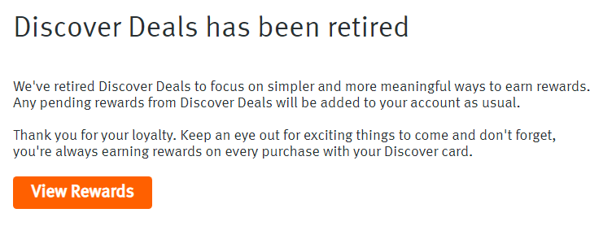

# Discover® Deals and Cashback Rewards Notifier

[](https://chrome.google.com/webstore/detail/discover%C2%AE-deals-and-cashb/ndgeljpfnjlnmbgekhjkchhhgoiipnfi)
[](https://chrome.google.com/webstore/detail/discover%C2%AE-deals-and-cashb/ndgeljpfnjlnmbgekhjkchhhgoiipnfi)
[](https://circleci.com/gh/nareddyt/discover-rewards-notifier/tree/master)
[](https://www.codacy.com/app/nareddyt/discover-rewards-notifier?utm_source=github.com&amp;utm_medium=referral&amp;utm_content=nareddyt/discover-rewards-notifier&amp;utm_campaign=Badge_Grade)
[](https://greenkeeper.io/)
[](https://github.com/MunGell/awesome-for-beginners)

A Chrome Extension that shows a notification when visiting sites that qualify for Discover® Deals or Cashback Rewards.

The intended end-users are customers of [Discover® Card](https://www.discover.com/).

<p align="center">
    
</p>

**Note:** *Discover Deals have been retired (by Discover) since November 2018.
This extension still displays Discover Cashback rewards, but no longer displays Discover Deals.*

<p align="center">
    
</p>


Table of Contents
=================

  * [Getting Started](#getting-started)
     * [Prerequisites](#prerequisites)
     * [Building the extension](#building-the-extension)
        * [Clone the repo](#clone-the-repo)
        * [Install npm dependencies](#install-npm-dependencies)
        * [Compile handlebars templates using npm](#compile-handlebars-templates-using-npm)
     * [Loading the extension into Chrome](#loading-the-extension-into-chrome)
  * [Developing](#developing)
     * [Discover® Data](#discover-data)
     * [UI](#ui)
     * [Core Extension Code](#core-extension-code)
     * [Tools and Scripts](#tools-and-scripts)
     * [Continuous Deployment](#continuous-deployment)
     * [Product Website](#product-website)
  * [Contributing](#contributing)
  * [Versioning](#versioning)
  * [Authors](#authors)
  * [License](#license)
  * [Acknowledgments](#acknowledgments)

## Getting Started

These instructions will get you a copy of the project up and running on your local machine for development and testing purposes.
The extension comes with the latest Discover® Deals and Cashback Rewards data, so you don't have to download those manually.

**NOTE:** Only follow these steps if you are a developer. **If you are NOT a developer**, you should install the extension by clicking on the picture below.

<p align="center">
    <a href="https://chrome.google.com/webstore/detail/discover%C2%AE-deals-and-cashb/ndgeljpfnjlnmbgekhjkchhhgoiipnfi">
        
    </a>
</p>

### Prerequisites

You'll need:

- `git` to clone the repo and make contributions
- `npm` to install developer dependencies and build the extension
- `Chrome Web Browser` to test the extension

### Building the extension

#### Clone the repo

```bash
git clone https://github.com/nareddyt/discover-rewards-notifier.git
cd discover-rewards-notifier/
```

#### Install `npm` dependencies

Run the command below to install the packages needed to build the extension.

**Note:** We use npm to manage *developer* dependencies. None of these dependencies are required when running the extension as a regular user.

```
npm install
```

#### Compile *handlebars templates* using `npm`

[Handlebars](http://handlebarsjs.com/) is a templating engine the extension uses for the UI. Run the command below to compile the required templates.

```
npm run compileTemplates
```

### Loading the extension into Chrome

The extension is now fully-built and ready to use. It needs to be loaded into the Chrome Web Browser so you can use it.

Follow the short list of steps from the [Chrome Developer Guide](https://developer.chrome.com/extensions/getstarted#unpacked) under the **Load the extension** section.

The extension should work now! Try visiting sites like www.jcrew.com and www.ae.com.

**Note:** You'll see a special *developer icon* when you load the extension. This helps differentiate between the production build and the developers' custom builds.

## Developing

Now that you have the extension setup, follow any one of these guides to learn how specific components work.

**Tips:**

- Take a look at the [issues page](https://github.com/nareddyt/discover-rewards-notifier/issues). Feel free to comment on anything that you have questions about or would like to work on!
- If you plan on contributing, **don't** develop on the repo you just cloned. Instead, you should make a **fork**, clone that fork to your computer, and develop with that. [Here is an excellent tutorial on how to use forks](https://gist.github.com/Chaser324/ce0505fbed06b947d962)
- After making changes, you must reload the extension in Chrome. See the following snippet from the [Chrome Developer Guide](https://developer.chrome.com/extensions/getstarted#unpacked):

> The files are only parsed when the extension is loaded. If you want to see your changes in action, the extension has to be reloaded. Visit the extensions page (go to chrome://extensions, or More Tools > Extensions under the Chrome menu), and click Reload under your extension.

### Discover® Data

See [data/README.md](data/README.md)

### UI

See [templates/README.md](templates/README.md)

### Core Extension Code

See [src/README.md](src/README.md)

### Tools and Scripts

See [tools/README.md](tools/README.md)

### Continuous Deployment

See [.circleci/README.md](.circleci/README.md)

### Product Website

See [docs/README.md](docs/README.md)

## Contributing

Please read [CONTRIBUTING.md](CONTRIBUTING.md) for details on submitting pull requests.

## Versioning

We use [SemVer](http://semver.org/) for versioning. For the versions available, see the [releases for this repository](https://github.com/nareddyt/discover-deals-notifier-extension/releases).

**Note:** Anytime a release is created, CircleCI automatically deploys the corresponding code to the Chrome Web Store.

## Authors

* **Tejasvi Nareddy** - *Creator and Maintainer* - [nareddyt](https://github.com/nareddyt)

See also the list of [contributors](https://github.com/nareddyt/discover-rewards-notifier/graphs/contributors) who participated in this project.

## License

This project is licensed under the GPLv3 License - see the [LICENSE](LICENSE) file for details

## Acknowledgments

See the [ACKNOWLEDGMENTS](ACKNOWLEDGMENTS) file for details
