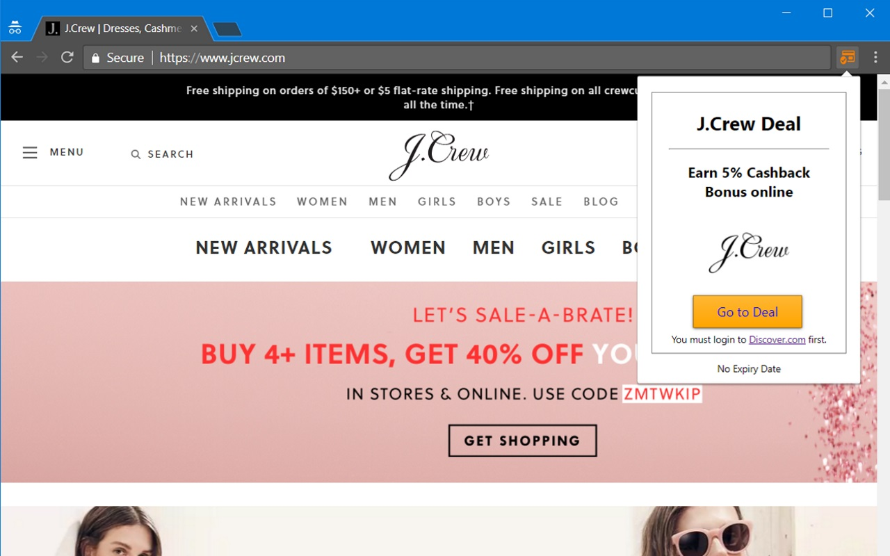

If you own a [Discover® Card](https://www.discover.com/) and use Google Chrome Web Browser, this extension is perfect for you. Don't miss out on another Discover® Deal or Cashback Reward again!

    

## Installation

You can install the extension from the Chrome Web Store by clicking on the image below.

    

## Usage

After installing the extension from the Chrome Web Store, you should see an icon appear to the right of your address bar.

The icon will turn orange when the site you visit has an active deal or cashback offer. You can then click on the icon to view more details and redeem the offer.

## Privacy Policy

[Click here](privacy-policy.md) to view our Privacy Policy

## License & Terms of Service

This project is open-source and licensed under **GPLv3**.

[Click here](license-and-tos.md) to view our License & Terms of Service